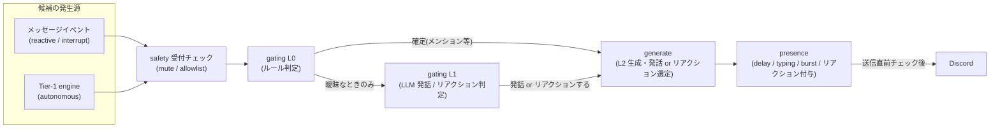
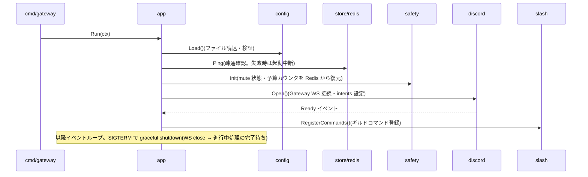
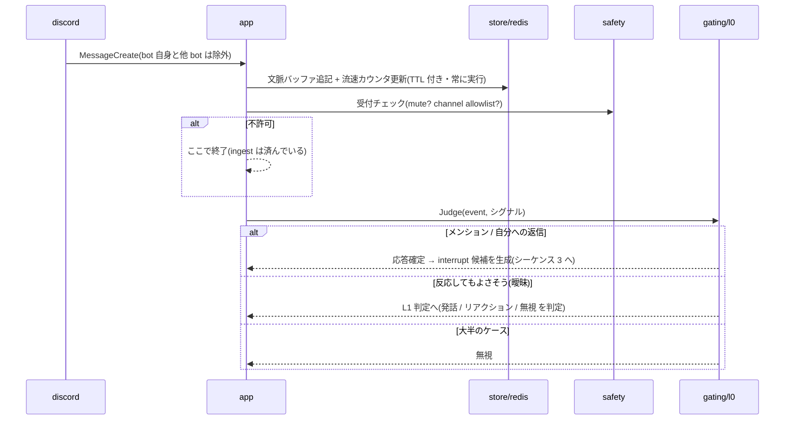
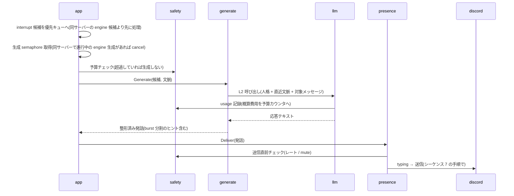
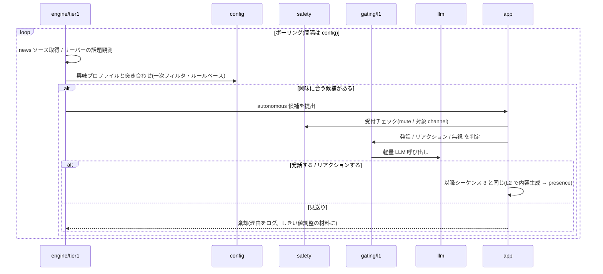
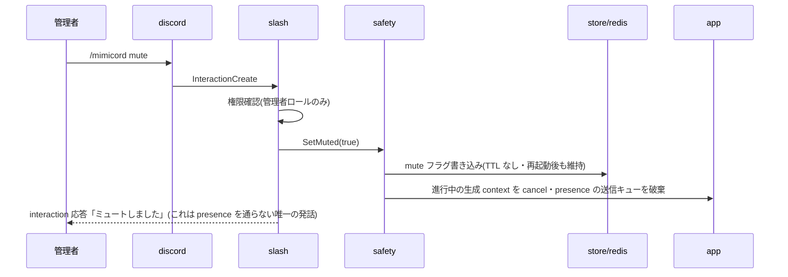
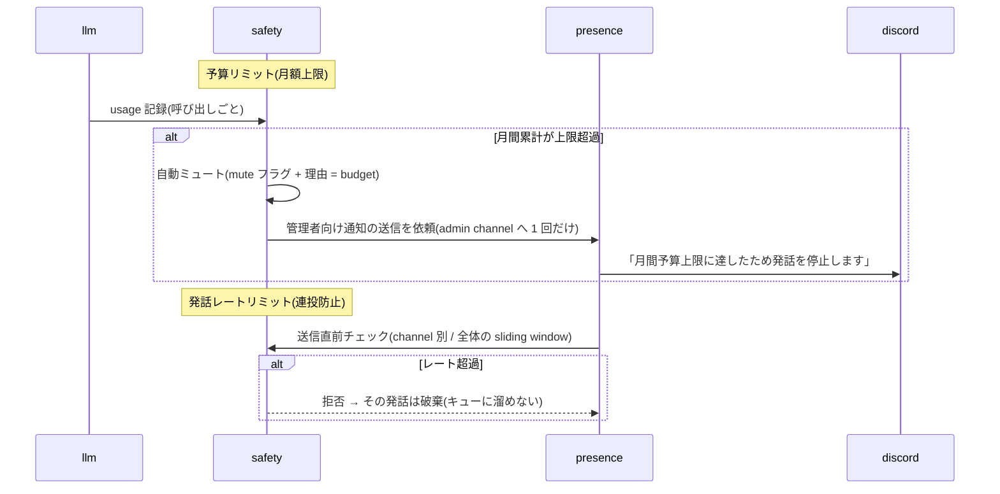
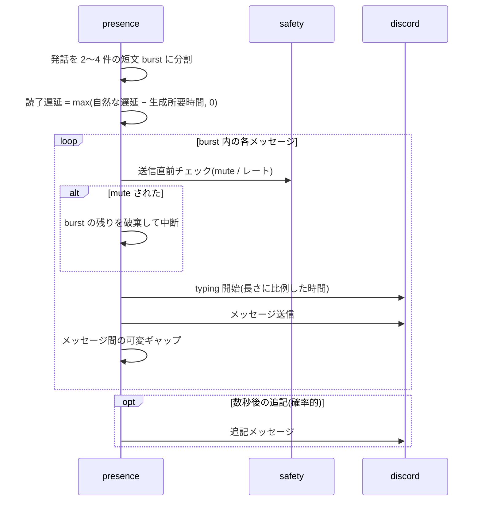

# 動作 → コード マッピング

> 「どの動作をどのコードに含めるのか」を実装着手前に固定するための文書。
> 本リポジトリ README の「設計原則」「コアループ」「アーキテクチャ」を、実装の責務マップへ落とす。
> パッケージの定義と依存ルールは [go-layout.md](go-layout.md) を参照。

## 基本モデル: 発話候補パイプライン

すべての発話・リアクションは「**候補(candidate)**」として生まれ、単一のパイプラインを通って Discord に出る。候補の発生源は 2 つ:

- **reactive**: メッセージイベント起点(メンション・返信・流れている話題への反応)。README で言う interrupt handler
- **autonomous**: Tier-1 engine 起点(news・話題を拾った自発発話)

### 横断ルール(パイプライン全体に適用される不変条件)

1. **送信の単一出口**: Discord への通常メッセージ送信・typing・リアクション付与は `internal/presence` だけが行う。例外はスラッシュコマンドの interaction 応答(`internal/slash`)のみ。
2. **safety の三重チェックポイント**: ①候補の受付時(mute / channel allowlist)、② LLM 呼び出し直前(予算)、③送信直前(発話レート / mute 再確認)。チェックはすべて `internal/safety` の関数呼び出しで、判定状態は Redis に置く(再起動・複数箇所からの参照に耐える)。
3. **同時生成はサーバー(ギルド)ごとに 1 件**(ギルド単位の semaphore)。「一度に一つのことに取り組む」(README「設計原則 / 意図的な能力の制限」)のコードへの翻訳で、各サーバーで bot が同時に複数の発話を進めないことを保証する(別サーバーの生成と並行するのは構わない。マルチサーバー化の前提)。interrupt 候補は engine 候補より優先し、待たされて陳腐化した engine 候補は捨てる(後から無理に発話しない)。
4. **すべての LLM 呼び出しは `internal/llm` を経由**し、usage(トークン・概算費用)が safety の予算カウンタに記録される。直接プロバイダ SDK を叩くコードを書かない。モデル変更の影響範囲をこの 1 パッケージに閉じることで、運用しながらのモデル差し替えを安全に行えるようにする。
5. **ingest は応答と独立**: 全メッセージイベントは応答するかどうかに関係なく、文脈バッファと流速カウンタ(Redis・TTL 付き)に記録される。

### 責務一覧(動作 × パッケージ)

| 動作 | 担当パッケージ | 備考 |
|---|---|---|
| Discord 接続・イベント受信・送信プリミティブ | `internal/discord` | discordgo の薄いラッパ。判定ロジックを持たない |
| メッセージ ingest(文脈・流速の記録) | `internal/app` → `internal/store/redis` | 全イベントで実行 |
| ルール一次判定(L0) | `internal/gating/l0` | mention/reply・経過時間・流速。純粋関数 + Redis シグナル |
| LLM 発話 / リアクション判定(L1) | `internal/gating/l1` | L0 で曖昧なときのみ。発話 / リアクションだけ返す / 無視 を判定 |
| 応答生成・リアクション選定(L2) | `internal/generate` | プロンプト組立て・文脈注入。発話と絵文字選定の両方を担う |
| LLM プロバイダ呼び出し・usage 計測 | `internal/llm` | L1 / L2 共用 |
| 発話実行(delay・typing・burst・リアクション付与) | `internal/presence` | 唯一の送信出口 |
| 自発発話の trigger・興味フィルタ | `internal/engine/tier1` | alpha は news ポーリング起点 |
| kill switch・allowlist・レート/予算リミット | `internal/safety` | 状態は Redis |
| スラッシュコマンド | `internal/slash` | safety / config の操作入口 |
| 人格 config・運用パラメータ | `internal/config` | ファイル + 実行時オーバーレイ |
| hot state アクセス | `internal/store/redis` | 型付きアクセサ |
| 配線・ライフサイクル・パイプライン制御 | `internal/app` | サーバー(ギルド)単位の semaphore・優先度・candidate キュー |

## シーケンス 1: 起動・Gateway 接続(実装①)

- 担当: `cmd/gateway`(main・シグナル処理)、`internal/app`(順序・失敗時の中断)、`internal/config` / `internal/store/redis` / `internal/safety` / `internal/discord` / `internal/slash`
- 起動時に **mute 状態を Redis から復元する**ことが重要(ミュート中に再起動しても喋り出さない)。

## シーケンス 2: メッセージ受信・ingest・L0 分岐(実装①〜②)

- 担当: `internal/discord`、`internal/app`、`internal/store/redis`、`internal/safety`、`internal/gating/l0`
- L0 は**純粋関数 + Redis シグナル参照**に保つ(LLM・I/O への直接依存なし)。テストの主戦場。
- **リアクションも LLM に任せる**: 「リアクションだけ返すか」は L1 が判定し、**絵文字選定は L2(リアクション専用プロンプト)** が行う。ルールベースの定型リアクションは持たない(人格・ノリが表れる箇所のため)。人格 config では使用候補の絵文字パレットだけ保持する。発話と異なり burst しないため、presence の役割は付与の実行のみ。

## シーケンス 3: メンション / 返信応答 — interrupt handler(実装②)

- 担当: `internal/app`、`internal/safety`、`internal/generate`、`internal/llm`、`internal/presence`、`internal/discord`
- メンションへの応答は L1 を**通さない**(呼びかけられたら返事をするのが自然なため。沈黙するのは mute / allowlist / 予算超過のときだけ)。
- prompt injection 対策(README「外部入力は untrusted」)はこの経路が主戦場: メンバー発言はデータとして渡し、システム指示と分離する。具体設計は `internal/generate` の実装時に決める。

## シーケンス 4: 自発発話 — Tier-1 engine(実装④)

- 担当: `internal/engine/tier1`、`internal/config`、`internal/safety`、`internal/gating/l1`、`internal/llm`、`internal/app`
- L1 の問いは「**発話 / リアクションだけ / 無視** のいずれか」であり、内容生成はしない。**発話しきい値 = 性格パラメータ**(README)の実体は、この L1 プロンプトと config 値の組。
- engine は候補を**提出するだけ**で、送信可否・タイミングに関与しない(パイプラインの下流に委ねる)。

## シーケンス 5: kill switch(実装①から)

- 担当: `internal/slash`、`internal/safety`、`internal/store/redis`、`internal/app`
- **キャンセルであってフラッシュではない**: 仕掛かり中の発話は破棄し、送信しない。
- 解除は `/mimicord unmute`。緊急時の代替手段(kubectl scale 0 / token reset)はデプロイ側の運用ドキュメントで定義する。

## シーケンス 6: ハードリミット発動(実装①から)

- 担当: `internal/safety`(判定・状態)、`internal/llm`(usage 報告)、`internal/presence`(実行点)
- 予算超過 → **自動ミュート**(解除は管理者の明示操作のみ。月替わりでの自動解除はしない)。レート超過 → **その発話だけ破棄**(溜めて後で送ると不自然なため)。
- 上限値(予算・レート窓)はコードへのハードコードを避け、運用側の config で与える。

## シーケンス 7: presence 実行 — typing と burst(実装③)

- 担当: `internal/presence`、`internal/safety`、`internal/discord`
- 遅延予算 `max(自然な遅延, cold start + 推論時間)`(README)の実装: 生成にかかった実時間を読了遅延から差し引く(生成が遅いほど待ち時間を短縮し、体感を一定に保つ)。
- burst 途中で mute されたら**残りを破棄**(シーケンス 5 と整合)。
- リズムを決めるパラメータ(読了遅延の基準・typing 速度・burst 件数の分布・メッセージ間ギャップ等)はすべて人格 config の管轄。**alpha は config の静的値(prior)で開始**し、ライブトラフィックからのオンライン較正(EWMA 等)は presence 安定後に重ねる。ただし Redis のキー設計だけは最初からサーバー単位で切る(将来のマルチサーバー化に備える。README「サーバーごとのキャリブレーション」)。

## alpha 実装順との対応

| 実装ステップ | 主に作るパッケージ | 本書の該当シーケンス |
|---|---|---|
| ① Gateway 接続 + L0 gating + 安全装置 | `cmd/gateway` `app` `config`(最小) `discord` `gating/l0` `safety` `store/redis` `slash`(mute/unmute のみ) | 1, 2, 5, 6 |
| ② メンション / 返信応答 | `generate` `llm` + presence の暫定版(即時送信) | 3 |
| ③ presence 層 | `presence`(typing・burst・遅延) | 7 |
| ④ Tier-1 engine | `engine/tier1` `gating/l1` | 4 |
| ⑤ 人格 config + スラッシュコマンド | `config`(スキーマ確定) `slash`(調整コマンド拡充) | 全体 |

- ①の時点で safety(mute・予算・レート)を**先に**作る。発話機能(②以降)より安全装置が先、という順序が本プロジェクトの方針。
- 人格 config のスキーマ確定は実装⑤(本書では立ち入らない)。ただし「どのパラメータが config 管轄か」は各シーケンスに記載済み。
