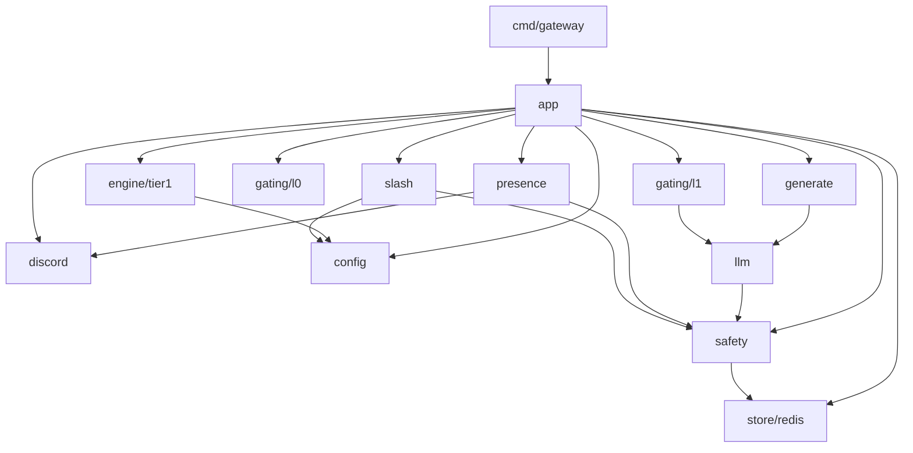

# Go プロジェクト構成

> 実装着手前の責務マップを固定するための文書。本リポジトリ README の「アーキテクチャ」と [docs/behavior-mapping.md](behavior-mapping.md) を、Go パッケージ構成に落とす。

## 方針

- module path: `github.com/mimicord/mimicord`
- **alpha は単一バイナリ**(`cmd/gateway`)。README の「Gateway + stateless LLM worker」は論理分離として実装し(`internal/llm` と `internal/generate` を gateway プロセス内で使う)、プロセス分離は次の条件が現れたときに `cmd/worker` を追加して行う:
  - マルチサーバー化で生成のスケールアウトが必要になる
  - Tier-2 sandbox で生成側を隔離環境に出す必要が生じる
  - 理由: 小規模運用の段階で IPC(キュー / HTTP)と worker の起動管理を持ち込むのは運用負荷が利益を上回る。stateless 性は「in-process の状態は使い捨ての判定キャッシュのみ」というコード規約で担保し、分離の seam はパッケージ境界として最初から確保しておく
- `pkg/` は作らない(公開 API が必要になるまで)。すべて `internal/` に置く

## ディレクトリツリー

```
mimicord/
├── cmd/
│   └── gateway/          # main。フラグ / 環境変数の解釈と app.Run() 呼び出しのみ
├── internal/
│   ├── app/              # 配線(DI)・ライフサイクル・候補キューと生成 semaphore
│   ├── config/           # 設定の読込・検証・実行時オーバーレイの合成
│   ├── discord/          # discordgo ラッパ(接続・イベント購読・送信プリミティブ)
│   ├── gating/
│   │   ├── l0/           # ルール一次判定(純粋関数 + シグナル参照)
│   │   └── l1/           # LLM による発話 / リアクション判定
│   ├── generate/         # L2 生成(プロンプト組立て・文脈注入・burst 分割ヒント・絵文字選定)
│   ├── llm/              # LLM プロバイダ抽象(クライアント・リトライ・usage 計測)
│   ├── presence/         # 発話実行(読了遅延・typing・burst・リアクション付与)
│   ├── engine/
│   │   └── tier1/        # 自発ループ(news ポーリング・興味フィルタ・候補提出)
│   ├── safety/           # kill switch・allowlist・レート / 予算リミット
│   ├── slash/            # スラッシュコマンド(運用操作の入口)
│   └── store/
│       └── redis/        # hot state の型付きアクセサ(文脈・カウンタ・safety 状態)
├── go.mod
└── README.md
```

`cmd/worker` と `store/firestore` は必要になるまで作らない([docs/behavior-mapping.md](behavior-mapping.md) の分離条件)。

## 各パッケージの責務と非責務

| パッケージ | 責務 | 持たないもの(非責務) |
|---|---|---|
| `cmd/gateway` | プロセス起動・シグナル → app へ委譲 | ロジック全般 |
| `app` | 依存の組み立て、起動 / 終了順序、候補の優先度キュー、生成 semaphore(同時 1 件) | ドメイン判定(gating / safety の中身) |
| `config` | ファイル読込・スキーマ検証・実行時オーバーレイ(スラッシュコマンド由来)との合成 | 設定値の解釈(各パッケージが行う) |
| `discord` | WS 接続管理・イベントの型変換・送信 / typing / リアクションのプリミティブ | 判定・発話可否(知らない) |
| `gating/l0` | mention / reply 検出、経過時間・流速によるルール判定 | I/O(シグナルは引数で受ける) |
| `gating/l1` | 「発話する / リアクションだけ返す / 無視」の LLM 判定プロンプトと解釈 | 生成(generate の領分) |
| `generate` | L2 プロンプト組立て(人格 + 文脈 + 対象)、応答の整形、リアクション専用プロンプトによる絵文字選定、untrusted 入力の分離 | プロバイダ呼び出しの実装(llm の領分) |
| `llm` | プロバイダクライアント(L1 用 / L2 用)、リトライ、usage → safety への報告 | プロンプト内容(呼び出し側の領分) |
| `presence` | burst 分割の実行、遅延 / typing のスケジューリング、リアクション付与、送信直前 safety チェック | 発話・リアクション内容の決定 |
| `engine/tier1` | ポーリング、興味フィルタ(ルールベース一次)、候補の提出 | 送信可否・タイミング(下流の領分) |
| `safety` | mute / allowlist / レート / 予算の状態と判定、自動ミュート | 通知文面の送信(presence へ依頼) |
| `slash` | コマンド登録・権限確認・safety / config への委譲、interaction 応答 | 状態の保持 |
| `store/redis` | キー設計(サーバー単位)、TTL、型付きアクセサ | ドメイン判定 |

## 依存方向



ルール(import 制約):

1. `discord` は他のドメインパッケージを import しない(イベントを app に渡すだけの末端)
2. `presence` 以外は `discord` の送信プリミティブを呼ばない(送信の単一出口。例外: `slash` の interaction 応答)
3. `gating/l0` は I/O を import しない(純粋関数。シグナルは引数)
4. `engine` と `presence` は互いを知らない(app が候補パイプラインで仲介)
5. **LLM プロバイダ SDK の import は `llm` 内に閉じる**(モデル変更の影響範囲を 1 パッケージに限定。プロバイダ・モデルの差し替えを運用しながら行えるようにするため)
6. `safety` はどこからでも呼べる薄い層に保つ(依存は store のみ)

## テスト方針(概略)

- 主戦場は `gating/l0`(純粋関数なのでテーブル駆動で網羅)と `safety`(リミットの境界値)
- `llm` はモック(record/replay)で、`discord` は interface 経由のフェイクで差し替える
- presence のタイミング制御は clock を注入して決定的にテストする
- E2E(実 Discord サーバーでの観測)は成功基準②③の評価そのものなので、自動テストではなく運用で見る

## 実装①の最小セット

実装①(Gateway 接続 + L0 gating + 安全装置)で作るのは: `cmd/gateway` / `app` / `config`(最小)/ `discord` / `gating/l0` / `safety` / `store/redis` / `slash`(mute・unmute・status のみ)。この時点では bot は**メンションに定型文で応答する程度**でよく(generate は実装②)、安全装置とイベント処理の骨格を先に固める。
